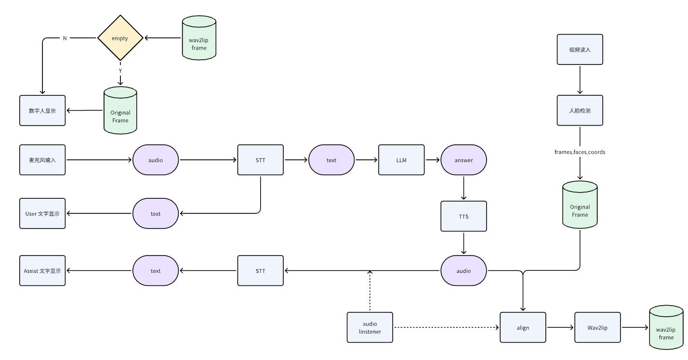

# 实时语音数字人项目

## 🌟 项目简介

这是一个基于 Wav2Lip 和大语言模型（LLM）的实时交互式数字人项目。它能够实现用户通过语音与数字人进行实时对话，数字人会根据对话内容智能地生成回复并进行唇形同步的视频呈现，为用户带来沉浸式的交流体验。


## ✨ 主要特性

*   **实时语音交互**: 用户通过麦克风输入语音，数字人实时进行语音识别并作出响应。
*   **智能对话**: 集成大语言模型，提供富有逻辑和知识的对话能力。
*   **唇形同步**: 利用 Wav2Lip 技术，确保数字人嘴型与生成语音高度匹配，提升真实感。
*   **模块化设计**: 各功能模块（STT, LLM, TTS, Wav2Lip）独立，易于维护和扩展。
*   **流媒体支持**: 支持 HLS 流媒体输出，便于在不同平台展示。

## 🚀 主要技术点

*   **语音转文字 (STT)**: Vosk
*   **文字转语音 (TTS)**: Edge-TTS
*   **大语言模型 (LLM)**: DeepSpeed-chat (基于 Qwen-1.5B)
*   **数字人生成/唇形同步**: Wav2Lip
*   **流媒体**: HLS 

## 📐 整体架构

项目的整体工作流程如下图所示，采用模块化设计，确保各组件高效协同：



### 流程概述：

1.  **视频/图像素材载入与人脸检测**: 加载数字人原始素材（如视频或图片），并进行人脸检测，提取面部关键信息。
2.  **用户语音输入**: 通过麦克风捕获用户语音。
3.  **语音转文字 (STT)**: 使用 Vosk 模型将用户语音实时转换为文本。
4.  **大语言模型 (LLM) 处理**: 将用户文本输入到基于 DeepSpeed-chat 的 Qwen-1.5B 模型，生成智能回复文本。
5.  **文字转语音 (TTS)**: 使用 Edge-TTS 将 LLM 生成的回复文本转换为数字人语音。
6.  **实时唇形同步 (Wav2Lip)**: 将原始视频帧、检测到的人脸信息以及数字人语音输入到 Wav2Lip 模型，实时生成与语音同步的唇形视频帧。
7.  **数字人显示**: 将生成的视频帧进行实时显示，呈现会说话的数字人形象。
8.  **HLS 流输出**: 数字人视频流可能通过 HLS 协议进行分发，实现多端播放。

## 📁 项目结构

```
.
├── 3rdrepo             # 存放第三方仓库，如 Wav2lip 源码
│   ├── Readme.md
│   └── Wav2lip
├── certificate         # SSL/TLS 证书（如果项目涉及HTTPS或安全连接）
├── config.py           # 项目配置文件，用于存储模型路径、API密钥等
├── dh                  # 数字人相关处理模块，可能包含素材处理、Wav2lip 调用逻辑
│   ├── __init__.py
│   ├── material        # 数字人素材（如原始视频、图片）
│   └── wav2lip         # Wav2Lip 处理核心逻辑
├── env.yaml            # Conda 环境配置文件，用于快速复现项目环境
├── hls.py              # HLS 流媒体服务相关逻辑，用于生成和提供流媒体
├── hls_stream          # HLS 流媒体分片文件存放目录 (.ts 文件和 .m3u8 播放列表)
│   └── ...
├── html                # 前端页面文件，如 `index.html` 用于展示数字人交互界面
│   └── index.html
├── llm                 # 大语言模型相关模块
│   ├── deepseek.py     # 可能是 DeepSpeed-chat 或特定 LLM 的接口封装
│   ├── __init__.py
│   ├── tts.py          # 文字转语音 (TTS) 接口封装
│   └── wav2lip.py      # Wav2Lip 模型调用接口封装 (与 dh/wav2lip 可能有职责区分)
├── main.py             # 项目主入口文件，协调各个模块运行
├── model               # 模型文件存放目录
│   ├── README.md
│   ├── vosk-model-en-us-0.22 -> /data/Weights/vosk-model-en-us-0.22  # Vosk 语音识别模型
│   └── wav2lip -> /data/Weights/wav2lip/                           # Wav2Lip 模型文件
│
└── test_data           # 测试数据，包含用于测试的音频、视频和图片素材
    ├── audio1.wav
    ├── girl.mp4
    ├── human.png
    ├── info.py
    ├── output.wav
    └── test.wav
```

## 🖥️ TODO List


*   [ ] **修复音频问题**: 音频传输出现问题，所以目前取消了音频的传输以保证项目正常运行
*   [ ] **LLM-chat bot接口**： 兼容API和本地部署的LLM
*   [ ] **Agent**: 部署Agent增强llm能力
*   [ ] **实时性修复**: 加快生成速度和质量


---

请定期更新此列表，以反映项目的最新状态。

## 🛠️ 快速开始

### 1. 环境准备

1.  **克隆项目**:
    ```bash
    git clone https://github.com/Man-PaperRejected/LLM-DH
    cd LLM-DH
    ```
2.  **创建 Conda 环境并安装依赖**:
    ```bash
    conda env create -f env.yaml
    conda activate dh-llm
    ```
    *注意*: 根据 `env.yaml` 内容，可能还需要手动安装一些 pip 依赖。

3.  **安装 FFmpeg**:
    FFmpeg 是音视频处理的关键工具，请确保已安装并配置到系统 PATH 中。
    *   **Linux**: `sudo apt update && sudo apt install ffmpeg`

### 2. 模型下载与配置

项目依赖 Wav2Lip 和 Vosk 的预训练模型。请将它们下载到 `model/` 目录下，或者配置正确的软链接指向它们。

*   **Vosk 模型**:
    *   下载 `vosk-model-en-us-0.22` (或你需要的其他语言模型) 从 [Vosk 官方模型库](https://alphacephei.com/vosk/models)。
    *   解压后，确保模型文件夹名为 `vosk-model-en-us-0.22` 并放置到 `model/` 目录下。
*   **Wav2Lip 模型**:
    *   参考 Wav2Lip 官方仓库 ([https://github.com/justadudewhohacks/wav2lip](https://github.com/justadudewhohacks/wav2lip)) 的指引下载预训练模型 (如 `wav2lip_gan.pth` 等)。
    *   将下载的模型文件放置到 `model/wav2lip/` 目录下。

*注意*: 项目中的模型路径使用了软链接,确保模型权重路径：
1.  wav2lip : model/wav2lip
2.  vosk : model/vosk-model-en-us-0.22

### 3. 运行项目

```bash
uvicorn main:app --host 127.0.0.1 --port 8000 --reload --workers 4
```


## 🤝 贡献

欢迎任何形式的贡献！如果你有改进项目的想法、发现 Bug 或希望添加新功能，请随时提交 Pull Request 或创建 Issue。


## 🙏 致谢

*   **Wav2Lip**: 感谢原作者提供强大的唇形同步技术。
*   **Vosk**: 感谢 Vosk 提供的轻量级语音识别模型。
*   **Edge-TTS**: 感谢其方便的文字转语音服务。
*   **DeepSpeed-chat & Qwen**: 感谢这些开源项目为 LLM 提供了强大的支持。

---